<div align="center">


<h1>Security Baselines Platform</h1>

<p><strong>The Strategic Governance Architecture for Defining, Validating, and Enforcing Secure Configuration Standards at Enterprise Scale.</strong></p>

[]()
[]()
[]()

<br/>

> **"Configuration is the new vulnerability."** 
> **Security Baselines (Baseline-Sec)** is an enterprise-grade platform designed to provide a secure, measurable, and highly automated foundation for configuration governance. It orchestrates the entire lifecycle—from multi-framework definition (CIS, NIST, ISO) and tier-based enforcement to real-time validation, drift detection, and automated remediation.

</div>

---

## 🏛️ Executive Summary

Modern infrastructure complexity has made manual configuration auditing impossible. Organizations often fail to secure their environments not because of a lack of tools, but because of fragmented standards and unmanaged configuration drift across thousands of resources that creates significant security gaps.

This platform provides the **Governance Control Plane**. It implements a complete **Compliance Intelligence Framework**, enabling Security and Platform teams to manage security baselines as a first-class citizen. By automating the validation of resource states and the enforcement of hardened standards, we ensure that every organizational component is continuously compliant, audited for regulatory requirements, and remediated with strategic precision.

---

## 📐 Architecture Storytelling: Principal Reference Models

### 1. Principal Architecture: Global Security Baselines & Compliance Orchestration Plane
This diagram illustrates the end-to-end flow from benchmark research and baseline definition to real-time multi-cloud validation and institutional compliance reporting.

```mermaid
graph LR
    %% Subgraph Definitions
    subgraph BaselineDefinition["Baseline Definition Hub"]
        direction TB
        CIS["CIS / NIST Research"]
        YAML["Baseline-as-Code (YAML/HCL)"]
        Versioning["Versioned Baseline Registry"]
    end

    subgraph IntelligenceEngine["Compliance Intelligence Hub"]
        direction TB
        API["FastAPI Governance Gateway"]
        Validator["Real-Time Validation Engine"]
        Drift["Drift & Regression Detector"]
        State["Resource State Inventory"]
    end

    subgraph EnforcementPlane["Tiered Enforcement Hub"]
        direction TB
        L1["L1: Foundational (Global)"]
        L2["L2: Enhanced (Restricted)"]
        L3["L3: Restricted (Secret)"]
    end

    subgraph OperationsHub["Compliance & Audit Hub"]
        direction TB
        Dash["Compliance Posture Dashboard"]
        Evidence["Audit Evidence Collector"]
        Remedy["Auto-Remediation Orchestrator"]
    end

    subgraph DevOps["Baselines-as-Code Orchestration"]
        direction TB
        GitOps["GitOps Baseline Distribution"]
        TF["Terraform Baseline Modules"]
        Lake["Forensic Baseline Lake"]
    end

    %% Flow Arrows
    BaselineDefinition -->|1. Define Standard| API
    API -->|2. Map to Tier| EnforcementPlane
    EnforcementPlane -->|3. Evaluate State| Validator
    Validator -->|4. Compare Baseline| State
    
    State -->|5. Detect Change| Drift
    Drift -->|6. Trigger Remediation| Remedy
    Remedy -->|7. Correct Config| EnforcementPlane
    
    API -->|8. Visualize Status| Dash
    Dash -->|9. Generate Attestation| Evidence
    
    GitOps -->|10. Push Baseline| API
    TF -->|11. Provision Hub| IntelligenceEngine
    API -->|12. Archive Audit| Lake

    %% Styling
    classDef definition fill:#f5f5f5,stroke:#616161,stroke-width:2px;
    classDef intel fill:#ede7f6,stroke:#311b92,stroke-width:2px;
    classDef enforce fill:#e3f2fd,stroke:#0d47a1,stroke-width:2px;
    classDef ops fill:#e8f5e9,stroke:#1b5e20,stroke-width:2px;
    classDef devops fill:#fffde7,stroke:#f57f17,stroke-width:2px;

    class BaselineDefinition definition;
    class IntelligenceEngine intel;
    class EnforcementPlane enforce;
    class OperationsHub ops;
    class DevOps devops;
```

### 2. The Baseline Lifecycle Management Flow
The continuous path of a security standard from research and definition to long-term audit attestation.

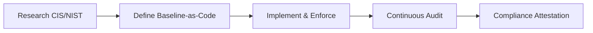

### 3. Tiered Baseline Security Model
Standardizing security controls based on workload criticality and business risk levels.

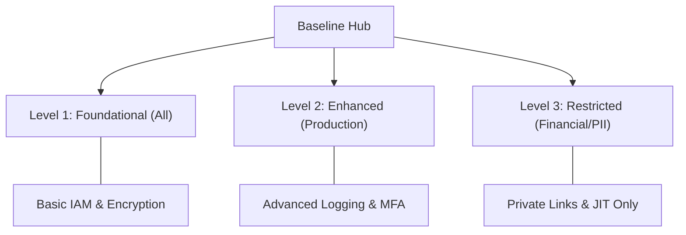

### 4. Multi-Cloud Baseline Ingestion Hub
Automating the ingestion of hardened benchmarks across AWS, Azure, GCP, and Kubernetes clusters.

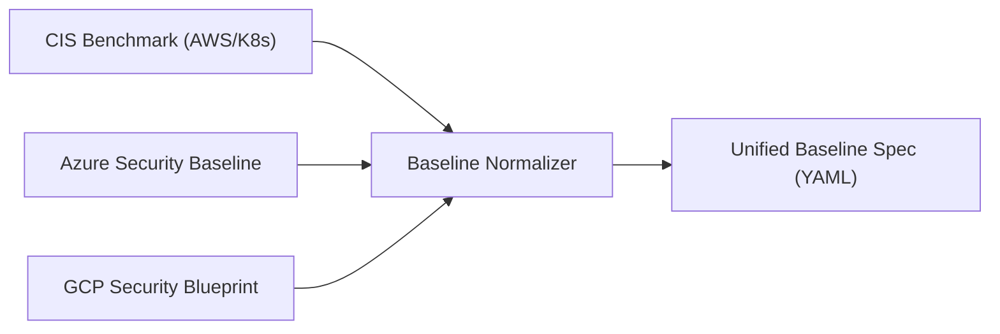

### 5. Policy-as-Code Implementation (HCL/OPA)
Enforcing baseline standards directly within the Infrastructure-as-Code pipeline using OPA or Terraform.

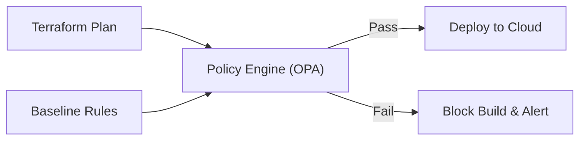

### 6. Baseline Drift & Auto-Remediation Flow
The logic for detecting and automatically correcting deviations from established security standards.

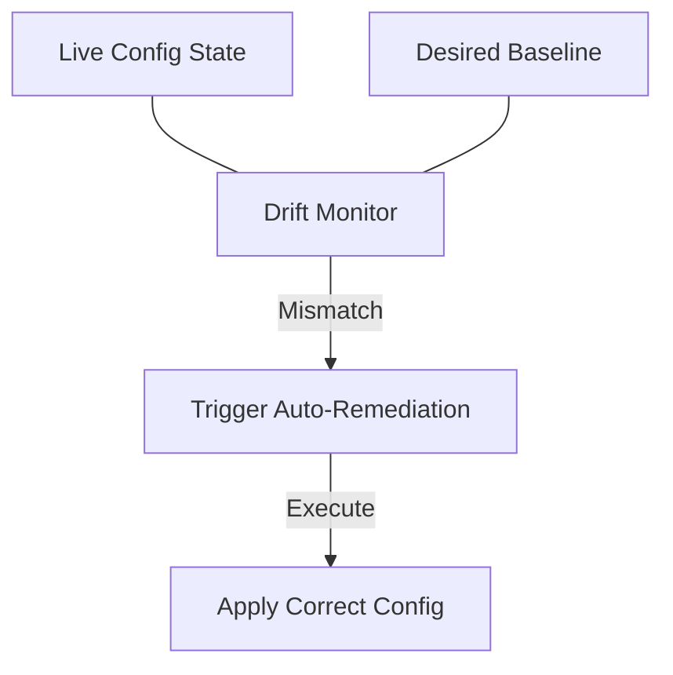

### 7. Service-Specific Baseline Matrix
Dedicated security controls for critical cloud-native services like S3, EKS, and RDS.

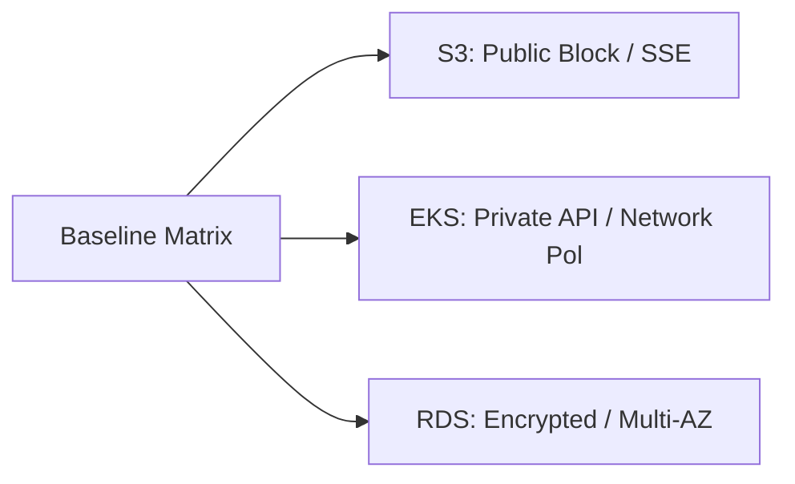

### 8. Identity & RBAC for Baseline Governance
Managing who has the authority to define standards, approve exceptions, and audit findings.

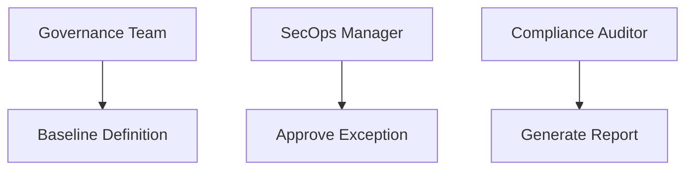

### 9. Compliance Reporting & Attestation Pipeline
Generating institutional evidence for SOC2, ISO, and NIST audits from live validation data.

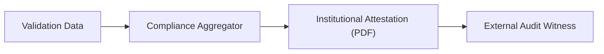

### 10. IaC Deployment: Baselines-as-Code Framework
Using Terraform to deploy and manage the versioned distribution of security baselines.

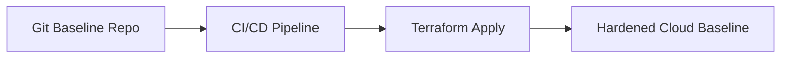

### 11. Metadata Lake for Forensic Baseline History
Storing long-term records of every configuration change and baseline violation for security investigations.

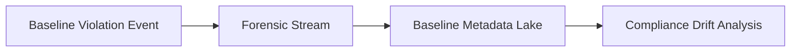

---

## 🏛️ Core Governance Pillars

1.  **Multi-Framework Baseline Hub**: Centralized repository for defining versioned standards mapped to industry benchmarks.
2.  **High-Fidelity Validation Engine**: Real-time evaluation of resource configurations against hardened baselines.
3.  **Advanced Drift Detection**: Continuous monitoring for "configuration creep" and security regressions.
4.  **Compliance Scoring & Heatmaps**: Executive-level visibility into compliance posture across business units.
5.  **Policy-as-Code Enforcement**: Integrated gates that block non-compliant configurations before production.
6.  **Immutable Audit Governance**: Comprehensive logging of validation results and exception approvals for audit readiness.

---

## 🛠️ Technical Stack & Implementation

### Governance Engine & APIs
*   **Framework**: Python 3.11+ / FastAPI.
*   **Baseline Engine**: Versioned configuration schemas for OS, Kubernetes, and Cloud providers.
*   **Validation Engine**: Real-time evaluation of resource state against institutional baselines.
*   **Drift Detector**: Continuous monitoring for configuration creep and regressions.
*   **State Management**: PostgreSQL (Metadata Lake) and Redis (Validation Cache).

### Compliance Dashboard (UI)
*   **Framework**: React 18 / Vite.
*   **Theme**: Dark Cyan / Slate (Modern Enterprise Governance aesthetic).
*   **Visualization**: Recharts for compliance trends and drift analytics.

### Infrastructure & DevOps
*   **Runtime**: AWS EKS or Azure Kubernetes Service (AKS).
*   **IaC**: Modular Terraform for deploying the governance hub and worker distributions.

---

## 🏗️ IaC Mapping (Module Structure)

| Module | Purpose | Real Services |
| :--- | :--- | :--- |
| **`infrastructure/governance`** | Central management plane | EKS, PostgreSQL, Redis |
| **`infrastructure/frameworks`** | Baseline spec and mapping | S3, DynamoDB, OPA |
| **`infrastructure/scanners`** | Validation and drift agents | Lambda, EventBridge, CloudTrail |
| **`infrastructure/reporting`** | Audit and evidence sinks | RDS, S3 Glacier, Quicksight |

---

## 🚀 Deployment Guide

### Local Principal Environment
```bash
# Clone the governance platform
git clone https://github.com/devopstrio/security-baselines.git
cd security-baselines

# Configure environment
cp .env.example .env

# Launch the Governance stack
make up

# Run a sample baseline validation
make validate-baseline target="k8s-cluster-01"

# Generate a compliance drift report
make drift-report
```

Access the Compliance Dashboard at `http://localhost:3000`.

---

## 📜 License
Distributed under the MIT License. See `LICENSE` for more information.

---
<div align="center">
  <p>© 2026 Devopstrio. All rights reserved.</p>
</div>
