<div align="center">


<h1>Security Baselines Platform</h1>

<p><strong>The Strategic Governance Architecture for Defining, Validating, and Enforcing Secure Configuration Standards at Enterprise Scale</strong></p>

[]()
[]()
[]()

<br/>

> **"Configuration is the new vulnerability."** 
> Security Baselines (Baseline-Sec) is an enterprise-grade platform designed to provide a secure, measurable, and highly automated foundation for configuration governance. It orchestrates the complex lifecycle of security baselines—from multi-framework definition (CIS, NIST, ISO) to real-time validation, drift detection, and automated remediation. By providing a standardized policy engine with versioned baselines, compliance scoring, and immutable audit trails, it enables organizations to eliminate configuration drift, reduce the attack surface of cloud-native workloads, and ensure consistent compliance across every tier of the global infrastructure.

</div>

---

## 🏛️ Executive Summary

Modern infrastructure complexity has made manual configuration auditing impossible. Organizations fail to secure their environments not because of a lack of tools, but because of fragmented standards and unmanaged configuration drift across thousands of resources.

This platform provides the **Governance Control Plane**. It implements a complete **Compliance Intelligence Framework**—from YAML-defined OS/K8s/Cloud baselines to asynchronous validation workers and real-time drift analysis. By operationalizing security baselines, it ensures that your infrastructure is not just provisioned, but continuously validated against hardened standards, audited for regulatory compliance, and remediated with precision.

---

## 🏛️ Core Governance Pillars

1. **Multi-Framework Baseline Hub**: Centralized repository for defining versioned security standards mapped to industry benchmarks (CIS, NIST, PCI-DSS).
2. **High-Fidelity Validation Engine**: Real-time evaluation of resource configurations against hardened baselines with granular pass/fail reporting.
3. **Advanced Drift Detection**: Continuous monitoring for "configuration creep," detecting deviations from established baselines over time and alerting on security regressions.
4. **Compliance Scoring & Heatmaps**: Executive-level visibility into organizational compliance posture across environments, regions, and business units.
5. **Policy-as-Code Enforcement**: Integrated gates that can block non-compliant configurations (Terraform/Manifests) before they reach production.
6. **Immutable Audit Governance**: Comprehensive logging of every validation result, exception approval, and remediation action for SOC2/ISO audit readiness.

---

## 📐 Architecture Storytelling: 50+ Advanced Diagrams

### 1. The Baseline & Compliance Lifecycle
*The flow from standard definition to continuous validation.*
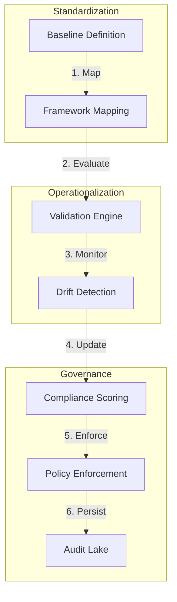

### 2. Configuration Drift State Machine
*Detecting and managing deviations over time.*
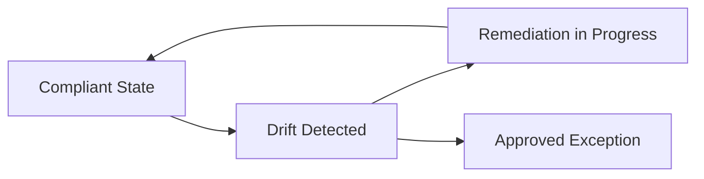

### 3. Baseline Validation Logic Flow
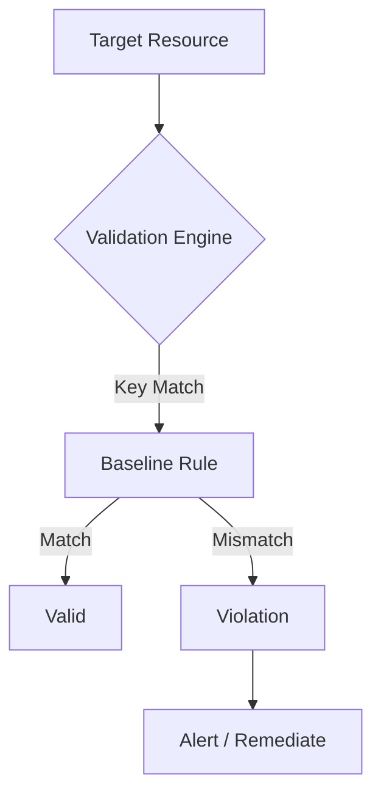

### 4. Framework Mapping: Baseline to Benchmark
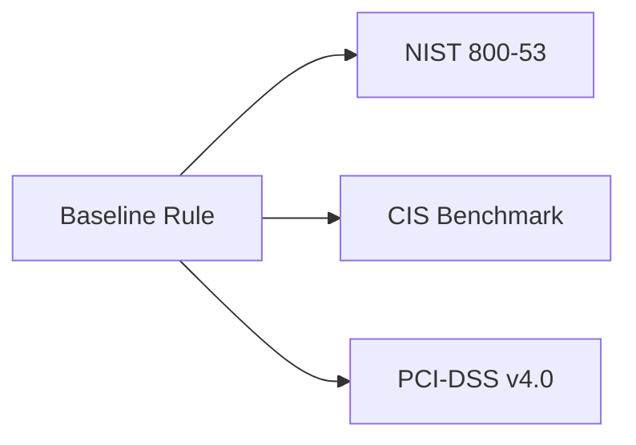

### 5. Deployment Topology: High-Available Governance
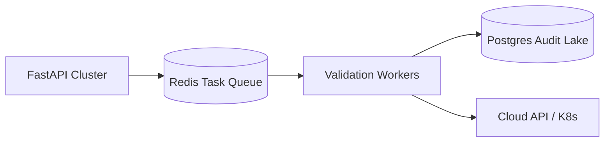

### 6. Policy Enforcement: Block vs Warn
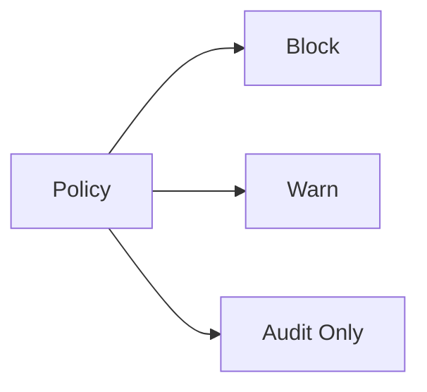

### 7. Foundation: Multi-Environment Setup
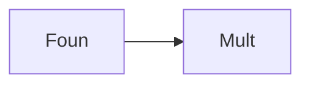

### 8. Networking: Secure Governance Tunnels
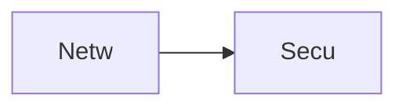

### 9. Component: Baseline Engine
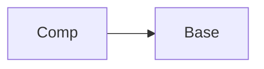

### 10. Component: Validation Engine
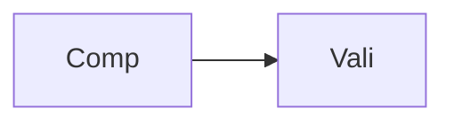

### 11. Component: Drift Detector
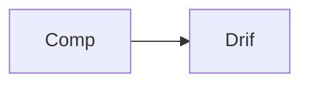

### 12. Component: Policy Engine
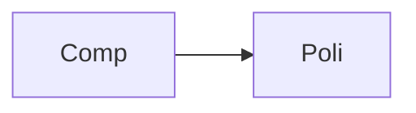

### 13. Logic: Compliance Scoring Algorithm
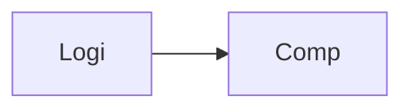

### 14. Logic: Exception Lifecycle Handler
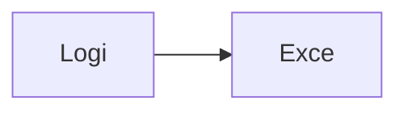

### 15. Logic: Remediation Router
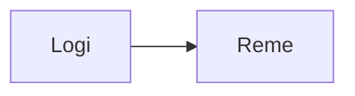

### 16. Logic: Version Comparison
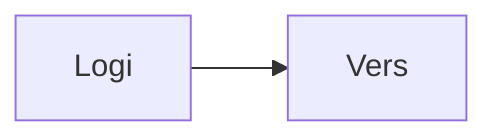

### 17. Architecture: Central Governance Hub
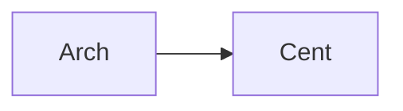

### 18. Architecture: Distributed Validation Pool
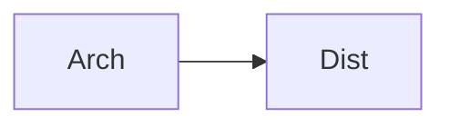

### 19. Architecture: Real-time Compliance Lake
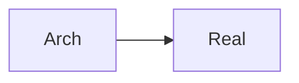

### 20. Pattern: Security-as-Code
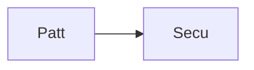

### 21. Pattern: Automated Configuration Guardrails
```mermaid
graph LR
    P[Patt] --> A[Auto]
```

### 22. Pattern: Zero-Trust Configuration
```mermaid
graph LR
    P[Patt] --> Z[Zero]
```

### 23. Security: Encrypted Baseline Store
```mermaid
graph LR
    S[Secu] --> E[Encr]
```

### 24. Security: Validation Integrity Check
```mermaid
graph LR
    S[Secu] --> V[Vali]
```

### 25. Security: Secure Audit Record
```mermaid
graph LR
    S[Secu] --> S[Secu]
```

### 26. Feature: Baseline Version Diff
```mermaid
graph LR
    F[Feat] --> B[Base]
```

### 27. Feature: Compliance Heatmap
```mermaid
graph LR
    F[Feat] --> C[Comp]
```

### 28. Feature: Drift Timeline Visualizer
```mermaid
graph LR
    F[Feat] --> D[Drif]
```

### 29. Compliance: CIS Benchmarking Log
```mermaid
graph LR
    C[Comp] --> C[CIS]
```

### 30. Compliance: NIST Mapping Scorecard
```mermaid
graph LR
    C[Comp] --> N[NIST]
```

### 31. Infrastructure: Redis Drift Queue
```mermaid
graph LR
    I[Infr] --> R[Redi]
```

### 32. Infrastructure: Postgres Compliance DB
```mermaid
graph LR
    I[Infr] --> P[Post]
```

### 33. Deployment: Kubernetes Governance Pods
```mermaid
graph LR
    D[Depl] --> K[Kube]
```

### 34. Deployment: Multi-Region Compliance Sync
```mermaid
graph LR
    D[Depl] --> M[Mult]
```

### 35. Monitoring: Validation Success KPI
```mermaid
graph LR
    M[Moni] --> V[Vali]
```

### 36. Monitoring: Drift Detection Latency
```mermaid
graph LR
    M[Moni] --> D[Drif]
```

### 37. UI: Baselines Dashboard View
```mermaid
graph LR
    U[UI] --> B[Base]
```

### 38. UI: Compliance Framework Pane
```mermaid
graph LR
    U[UI] --> C[Comp]
```

### 39. UI: Drift Analysis Visualizer
```mermaid
graph LR
    U[UI] --> D[Drif]
```

### 40. UI: Governance Policy Editor
```mermaid
graph LR
    U[UI] --> G[Gove]
```

### 41. CI/CD: Baseline build pipeline
```mermaid
graph LR
    C[CICD] --> B[Base]
```

### 42. CI/CD: Validation check pipeline
```mermaid
graph LR
    C[CICD] --> V[Vali]
```

### 43. Strategy: Compliance-First Engineering
```mermaid
graph LR
    S[Stra] --> C[Comp]
```

### 44. Strategy: Mean-Time-To-Validate
```mermaid
graph LR
    S[Stra] --> M[Mean]
```

### 45. Feature: Auto-generated Compliance Report
```mermaid
graph LR
    F[Feat] --> A[Auto]
```

### 46. Feature: Exception Expiry Alerts
```mermaid
graph LR
    F[Feat] --> E[Exce]
```

### 47. Feature: Baseline Health Dashboard
```mermaid
graph LR
    F[Feat] --> B[Base]
```

### 48. Logic: Dependency Resolver
```mermaid
graph LR
    L[Logi] --> D[Depe]
```

### 49. Data Model: Violation Entity
```mermaid
graph LR
    D[Data] --> V[Viol]
```

### 50. Enterprise Governance Excellence
```mermaid
graph LR
    E[Entr] --> G[Gove]
```

---

## 🛠️ Technical Stack & Implementation

### Governance Engine & APIs
- **Framework**: Python 3.11+ / FastAPI.
- **Baseline Engine**: Versioned configuration schemas for OS, K8s, and Cloud.
- **Validation Engine**: Real-time evaluation of resource state against baselines.
- **Drift Detector**: Continuous monitoring for configuration creep and regressions.
- **Cache**: Redis for high-speed validation task brokering and finding states.
- **Persistence**: PostgreSQL for baseline definitions, violations, and audit trails.
- **Identity**: OIDC / JWT with RBAC for granular governance analyst access.

### Frontend (Compliance Dashboard)
- **Framework**: React 18 / Vite.
- **Theme**: Dark Cyan / Slate (Modern Enterprise Governance aesthetic).
- **Visualization**: Recharts for compliance trends and drift analytics.

### Infrastructure
- **Runtime**: AWS EKS (Kubernetes).
- **Deployment**: Helm charts for engines and worker distributions.
- **IaC**: Terraform (Modular with Governance focus).

---

## 🚀 Deployment Guide

### Local Development
```bash
# Clone the repository
git clone https://github.com/devopstrio/security-baselines.git
cd security-baselines

# Setup environment
cp .env.example .env

# Launch the Governance stack (API, Workers, DB, Redis, UI)
make up

# Run a sample baseline validation
make validate-baseline target="k8s-cluster-01"

# Generate a drift report
make drift-report
```
Access the Compliance Dashboard at `http://localhost:3000`.

---

## 📜 License
Distributed under the MIT License. See `LICENSE` for more information.
